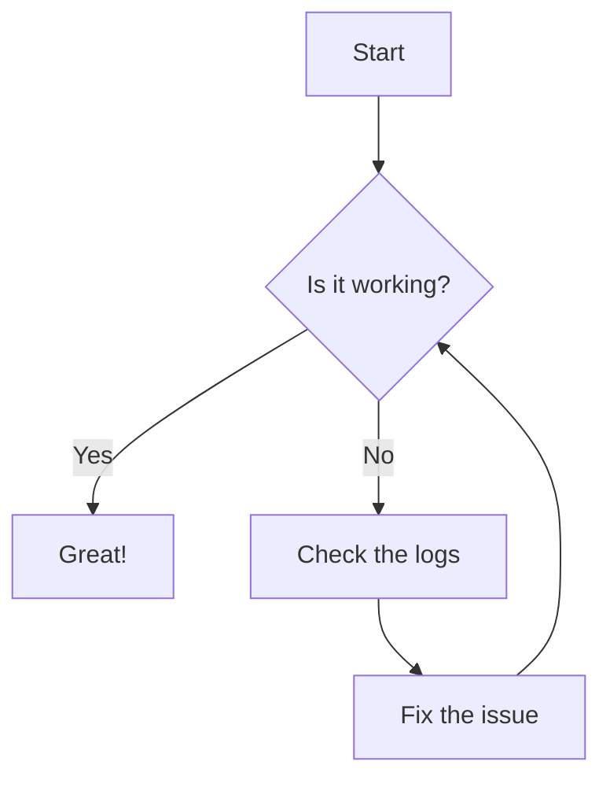

Reference pages are ideal for outlining how things work in terse and clear terms.
Less concerned with telling a story or addressing a specific use case, they should give a comprehensive outline of what you're documenting.

## Further reading

- Read [about reference](https://diataxis.fr/reference/) in the Diátaxis framework

